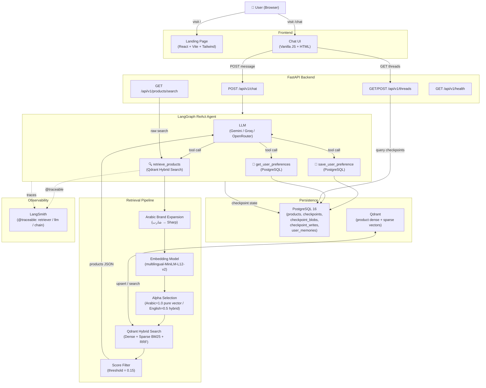

<div align="center">

# 🤖 RayaShop Agent

**An AI-powered shopping assistant for [RayaShop](https://www.rayashop.com/en) — find the right product from thousands with a single request, in any language.**


<br/>


</div>

---

## ✨ Overview

RayaShop Agent is a production-ready, conversational AI shopping assistant built on top of RayaShop's product catalog. Users send natural language queries — in **English or Egyptian Arabic** — and the agent retrieves semantically relevant products using a **hybrid vector + BM25 retrieval pipeline**, responds conversationally via an LLM, and surfaces product cards with images, prices, and direct store links.

The system is built around a **LangGraph ReAct agent** with three tools: product retrieval (Qdrant), preference saving (PostgreSQL), and preference recall. Conversation state is **checkpointed to PostgreSQL** so sessions persist across restarts. All retrieval and LLM generation steps are **traced to LangSmith** for observability.

---

## 📸 Screenshots

| Landing Page | Chat UI |
|:---:|:---:|
|  |  |
| *React landing page with animated robot mascot, CTA buttons, and HLS video background* | *Three-panel chat UI: session sidebar · conversation area · real-time product recommendations panel* |

---

## 🎯 Key Features

| Feature | Details |
|---|---|
| 🧠 **ReAct Agent (LangGraph)** | Tool-calling agent built with `create_react_agent`; decides autonomously when to search, recall, or respond |
| 🔎 **Hybrid Search (Qdrant)** | Combines dense vector search (multilingual MiniLM) + sparse BM25 with Reciprocal Rank Fusion (RRF) |
| 🌍 **Multilingual** | Strict language matching — Arabic queries get Arabic responses; English queries get English responses |
| 🗄️ **Persistent Memory** | User preferences (budget, brand, color) saved per-thread to PostgreSQL; recalled in future turns |
| ⚡ **PostgreSQL Checkpointer** | Full conversation state checkpointed via `langgraph-checkpoint-postgres`; threads survive server restarts |
| 🔌 **Pluggable LLM** | Swap between Gemini, OpenRouter, or Groq via a single `.env` variable — no code changes needed |
| 📊 **LangSmith Tracing** | `@traceable` decorators on retrieval, generation, and full RAG chain; traces sent to LangSmith project |
| 🗃️ **Data Pipeline** | Full scraping → PostgreSQL → Qdrant ingestion pipeline with dense + sparse dual embedding |
| 📐 **Retrieval Eval Suite** | Golden set of 12 queries (positive + negative) with Hit@k, MRR, Precision@k metrics |
| 🐳 **Docker Compose** | One-command deployment of app + Qdrant + PostgreSQL with health checks |

---

## 🏗️ System Architecture



---

## 📁 Project Structure

```
RayaShop-Agent/
├── src/
│   ├── main.py                        # FastAPI app: lifespan, routers, static serving
│   ├── Agent/
│   │   ├── shopping_agent.py          # LangGraph ReAct agent (singleton)
│   │   ├── checkpointer.py            # PostgresSaver with MemorySaver fallback
│   │   └── tools/
│   │       ├── retrieval_tool.py      # Qdrant hybrid search tool (@tool)
│   │       └── memory_tool.py         # save/get user preferences via PostgreSQL
│   ├── api/
│   │   ├── routes/
│   │   │   ├── chat.py                # POST /api/v1/chat
│   │   │   ├── products.py            # GET  /api/v1/products/search
│   │   │   ├── threads.py             # GET/POST /api/v1/threads
│   │   │   └── health.py              # GET  /api/v1/health
│   │   └── schemas/                   # Pydantic request/response models
│   ├── infrastructure/
│   │   ├── llm/
│   │   │   ├── factory.py             # LLMFactory (Gemini / Groq / OpenRouter)
│   │   │   └── providers/             # gemini.py, groq.py, openrouter.py
│   │   ├── embeddings/
│   │   │   ├── factory.py             # EmbeddingFactory
│   │   │   └── providers/             # huggingface.py, gemini.py
│   │   ├── vector_db/
│   │   │   ├── factory.py             # VectorDBFactory
│   │   │   ├── interface.py           # VectorStore ABC
│   │   │   └── providers/
│   │   │       ├── qdrant.py          # QdrantDB: hybrid search with RRF fusion
│   │   │       └── weaviate.py        # WeaviateDB (alternative provider)
│   │   ├── scraping/                  # Raya scraper (category + product detail)
│   │   └── ingestion/                 # Product ingestion pipeline
│   ├── db/
│   │   ├── models/
│   │   │   ├── product.py             # SQLAlchemy Product model (JSONB attributes)
│   │   │   └── product_image.py       # ProductImage model
│   │   ├── repositories/product.py    # ProductRepository (CRUD)
│   │   ├── session.py                 # SQLAlchemy engine + SessionLocal
│   │   └── migration/                 # Alembic migrations (3 revisions)
│   ├── config/
│   │   └── settings.py                # Pydantic Settings (nested, env-driven)
│   ├── observability/
│   │   └── tracing.py                 # LangSmith setup + @traceable wrappers
│   └── scripts/
│       ├── clear_chats.py             # Truncate checkpoints + user_memories
│       ├── postgres_to_qdrant.py      # Postgres → Qdrant ingestion (dense + sparse)
│       └── postgres_to_weaviate.py    # Postgres → Weaviate ingestion
├── frontend/
│   ├── src/
│   │   ├── App.tsx                    # Landing page (React, Framer Motion, HLS video)
│   │   └── components/
│   │       ├── Navbar.tsx
│   │       └── BackgroundBeams.tsx
│   └── public/
│       ├── chat.html                  # Chat page (vanilla HTML)
│       ├── app.js                     # Chat logic: sessions, messaging, product panel
│       └── styles.css                 # Chat UI styles
├── tests/
│   ├── integration/                   # Agent, LLM, Qdrant, Weaviate, retrieval tests
│   └── unit/                          # Vector DB unit tests
├── eval/
│   ├── golden_set.py                  # 12 golden queries (positive + negative)
│   └── run_eval.py                    # Hit@k, MRR, Precision@k runner
├── docker-compose.yml                 # App + Qdrant + PostgreSQL
├── Dockerfile                         # Python 3.12 + uv
├── pyproject.toml                     # Project dependencies
└── .env                               # Environment configuration
```

---

## 🛠️ Tech Stack

| Layer | Technology |
|---|---|
| **Backend** | FastAPI 0.115+, Python 3.12, Uvicorn |
| **Agent Framework** | LangGraph 1.2+ (`create_react_agent`), LangChain Core |
| **LLM Providers** | Google Gemini, Groq, OpenRouter (switchable via `.env`) |
| **Embedding Model** | `paraphrase-multilingual-MiniLM-L12-v2` (HuggingFace, dim=384) |
| **Sparse Embedding** | `fastembed` with `Qdrant/bm25` model |
| **Vector Database** | Qdrant (primary) · Weaviate (alternative) |
| **Relational Database** | PostgreSQL 16 (products + LangGraph state + user memories) |
| **ORM / Migrations** | SQLAlchemy 2.0, Alembic |
| **State Persistence** | `langgraph-checkpoint-postgres` (`PostgresSaver`) |
| **Observability** | LangSmith (`@traceable` on retriever, llm, chain) |
| **Landing Page** | React 18, TypeScript, Vite, Tailwind CSS, Framer Motion, HLS.js |
| **Chat UI** | Vanilla JS + CSS |
| **Deployment** | Docker Compose (app + Qdrant + PostgreSQL) |
| **Package Manager** | `uv` |

---

## ⚙️ Configuration

All configuration is driven by environment variables. Copy `.env.example` → `.env` and fill in your values.

```bash
# ── Application ──────────────────────────────────
APP__NAME=RayaShop Agent
APP__ENV=production
APP__DEBUG=false

# ── API ──────────────────────────────────────────
API__HOST=0.0.0.0
API__PORT=8000

# ── PostgreSQL ────────────────────────────────────
POSTGRES__HOST=localhost
POSTGRES__PORT=5432
POSTGRES__DATABASE=rayashop
POSTGRES__USER=rayashop_user
POSTGRES__PASSWORD=your_password

# ── Vector Database ───────────────────────────────
VECTOR_DB_PROVIDER=qdrant     # or: weaviate
QDRANT__URL=http://localhost:6333
QDRANT__API_KEY=your_qdrant_api_key
QDRANT__COLLECTION_NAME=rayashop_products
QDRANT__VECTOR_SIZE=384
QDRANT__DISTANCE_METRIC=cosine

# ── Embedding ─────────────────────────────────────
EMBEDDING__PROVIDER=huggingface
EMBEDDING__HUGGINGFACE__MODEL_NAME=sentence-transformers/paraphrase-multilingual-MiniLM-L12-v2

# ── LLM (choose one) ─────────────────────────────
LLM__PROVIDER=gemini          # or: openrouter / groq
LLM__GEMINI__API_KEY=your_gemini_key
LLM__GEMINI__MODEL=gemini-2.0-flash

LLM__OPENROUTER__API_KEY=your_openrouter_key
LLM__OPENROUTER__MODEL=google/gemini-2.0-flash-exp:free

LLM__GROQ__API_KEY=your_groq_key
LLM__GROQ__MODEL=llama3-8b-8192

# ── Scraper ───────────────────────────────────────
SCRAPER__PROVIDER=raya
SCRAPER__RAYA__BASE_URL=https://www.rayashop.com
SCRAPER__RAYA__API_KEY=your_raya_api_key
SCRAPER__RAYA__STORE_CODE=eg

# ── LangSmith ─────────────────────────────────────
LANGSMITH_TRACING=true
LANGSMITH_ENDPOINT=https://api.smith.langchain.com
LANGSMITH_API_KEY=your_langsmith_api_key
LANGSMITH_PROJECT=RayaShopT
```

---

## 🚀 Quick Start

### Option 1 — Docker Compose (Recommended)

```bash
# 1. Clone the repository
git clone https://github.com/your-username/RayaShop-Agent.git
cd RayaShop-Agent

# 2. Copy and configure environment
cp .env.example .env
# Edit .env with your API keys

# 3. Build the frontend
npm install && npm run build

# 4. Start all services (app + Qdrant + PostgreSQL)
docker compose up --build

# 5. Open in browser
open http://localhost:8000
```

### Option 2 — Local Development

**Prerequisites:** Python 3.12+, PostgreSQL 16, Qdrant, Node 18+, `uv` installed.

```bash
# 1. Install dependencies
uv sync

# 2. Build the frontend
npm install && npm run build

# 3. Run database migrations
uv run alembic upgrade head

# 4. Ingest products into Qdrant
uv run python -m src.scripts.postgres_to_qdrant

# 5. Start the development server
uv run uvicorn main:app --reload --port 8000
```

---

## 🔄 Data Pipeline

The full pipeline runs in three stages:

```
Raya API (scraper) → PostgreSQL (SQLAlchemy) → Qdrant (dense + sparse vectors)
```

```bash
# Stage 1: Ingest product catalog into Qdrant
# (reads from PostgreSQL, generates dense + sparse embeddings, upserts to Qdrant)
uv run python -m src.scripts.postgres_to_qdrant
```

The ingestion script:
1. Builds a rich semantic text per product: `Product: {name}\nBrand: {brand}\nCategory: {category}\nDescription: {desc}\n{attributes...}`
2. Generates **dense vectors** via `paraphrase-multilingual-MiniLM-L12-v2`
3. Generates **sparse BM25 vectors** via `fastembed Qdrant/bm25`
4. Upserts dual-vector records into Qdrant with full product payloads in batches of 128

---

## 🤖 Agent Architecture

The agent is a **LangGraph `create_react_agent`** singleton compiled once at startup and reused across all requests via a shared `PostgresSaver` checkpointer.

### Tools

| Tool | Run Type | Description |
|---|---|---|
| `retrieve_products` | `@tool` + `@traceable(retriever)` | Hybrid Qdrant search. Returns JSON list of products. |
| `save_user_preference` | `@tool` | Persists `key=value` preferences per `thread_id` to `user_memories`. |
| `get_user_preferences` | `@tool` | Fetches all stored preferences for the current `thread_id`. |

### Retrieval Logic in Detail

```
User query
    ↓
[Arabic brand expansion] — "شارب تورنيدو" → appends "Sharp Tornado"
    ↓
[E5 prefix] — "query: {expanded_text}" for HuggingFace E5 models
    ↓
[Alpha selection]
    Arabic  → alpha=1.0 → pure dense vector (avoids BM25 garbled-char noise)
    English → alpha=0.5 → RRF fusion of dense prefetch + BM25 sparse prefetch
    ↓
[Qdrant query_points with Prefetch + FusionQuery(RRF)]
    ↓
[Score filter: discard score < 0.15]
    ↓
Structured product JSON returned to LLM
```

### PostgreSQL Checkpointer Tables

| Table | Purpose |
|---|---|
| `checkpoints` | Full agent state snapshots per thread |
| `checkpoint_blobs` | Binary data blobs for large state values |
| `checkpoint_writes` | Incremental write log |
| `checkpoint_migrations` | Schema version tracking |
| `user_memories` | Per-thread user preferences (brand, budget, etc.) |

> **Important:** `ConnectionPool` must be initialized with `kwargs={"autocommit": True}`. `PostgresSaver.setup()` runs `CREATE INDEX CONCURRENTLY` which cannot execute inside a transaction block.

---

## 🌐 API Reference

### `POST /api/v1/chat`

```json
// Request
{
  "message": "عاوز تكييف شارب 1.5 حصان",
  "thread_id": "optional-uuid"
}

// Response
{
  "thread_id": "550e8400-e29b-41d4-a716-446655440000",
  "response": "لقيتلك 3 تكييفات شارب بـ 1.5 حصان، شوف المنتجات على اليمين!",
  "products": [
    {
      "id": 1234,
      "name": "Sharp 1.5HP Inverter AC",
      "brand": "Sharp",
      "price": 18999.0,
      "old_price": 21999.0,
      "url": "https://www.rayashop.com/...",
      "thumbnail": "https://...",
      "stock_status": "in_stock"
    }
  ]
}
```

### `GET /api/v1/products/search?q=iphone+16&limit=7`

Natural language product search — returns raw retrieval results without LLM generation.

### `GET /api/v1/threads` · `POST /api/v1/threads`

List all historical sessions from PostgreSQL checkpoints / create a new session.

### `GET /api/v1/threads/{id}/messages`

Retrieve full conversation history for a thread.

### `GET /api/v1/health`

Returns service status, API version, and uptime in seconds.

---

## 📊 Retrieval Evaluation

```bash
# Default k=5
uv run python -m eval.run_eval

# k=3 with verbose query notes
uv run python -m eval.run_eval --k 3 --verbose
```

**Metrics reported:**

| Metric | Description |
|---|---|
| **Hit@k** | ≥1 relevant result in top-k (positive cases only) |
| **MRR** | Mean Reciprocal Rank — `1/rank` of first relevant hit |
| **Precision@k** | Fraction of relevant results in top-k |
| **Negative Accuracy** | Fraction of greetings/nonsense that correctly return nothing |
| **Avg Latency** | Mean retrieval latency (ms) |

**Golden set examples:**

```python
{"query": "SONY WH-1000XM5",      "expect_any": ["wh-1000xm5"]}  # Exact model
{"query": "wireless headphones",   "expect_any": ["wireless", "headphone"]}  # Semantic
{"query": "اهلا",                   "expect_any": []}  # Greeting → no results
{"query": "flying car with wings", "expect_any": []}  # Non-catalog → no results
```

---

## 📈 Observability

Instrumented with [LangSmith](https://smith.langchain.com) `@traceable` at three levels:

```python
from src.observability import trace_retrieval, trace_generation, trace_rag_pipeline

# Trace retrieval span only (run_type="retriever")
products = trace_retrieval(query="iPhone 16", limit=5)

# Trace LLM generation span only (run_type="llm")
response = trace_generation(user_message="Find me a laptop", context="...")

# Trace full RAG chain as single parent span (run_type="chain")
result = trace_rag_pipeline(user_query="تكييف شارب", limit=5)
```

---

## 🧪 Tests

```bash
# All tests
uv run pytest

# Integration tests
uv run pytest tests/integration/ -v

# Unit tests
uv run pytest tests/unit/ -v
```

| Test File | Coverage |
|---|---|
| `test_shopping_agent.py` | End-to-end agent invocation |
| `test_qdrant_retrieval.py` | Hybrid search correctness |
| `test_agent_memory.py` | Preference save/recall across turns |
| `test_llm_providers.py` | Gemini / Groq / OpenRouter connectivity |
| `test_retrieval_tool.py` | Tool invocation and score filtering |
| `test_vector_db.py` | VectorStore unit tests |

---

## 🛠️ Utility Scripts

```bash
# Clear all chat history and user memories (useful before demos)
uv run python -m src.scripts.clear_chats

# Re-ingest all products from PostgreSQL into Qdrant
uv run python -m src.scripts.postgres_to_qdrant
```

---

## 🗃️ Database Schema

### `products` table

| Column | Type | Notes |
|---|---|---|
| `id` | `BIGINT PK` | Product ID |
| `name` | `TEXT NOT NULL` | Product name |
| `sku` | `VARCHAR(255) UNIQUE` | Stock-keeping unit |
| `url` | `TEXT NOT NULL` | Product page URL |
| `brand` | `VARCHAR(255)` | Brand name (indexed) |
| `category` | `VARCHAR(255)` | Category (indexed) |
| `description` | `TEXT` | Full description |
| `short_description` | `TEXT` | Short description |
| `attributes` | `JSONB` | Flexible product specs |
| `price` | `NUMERIC(12,2)` | Current price (EGP) |
| `old_price` | `NUMERIC(12,2)` | Pre-discount price |
| `thumbnail` | `TEXT` | Thumbnail image URL |
| `stock_status` | `VARCHAR(50)` | `in_stock` / `out_of_stock` (indexed) |
| `created_at` | `TIMESTAMPTZ` | Auto-set on insert |
| `updated_at` | `TIMESTAMPTZ` | Auto-updated on change |

Alembic migrations: 3 revisions tracking `products` table creation, images column removal, and rich detail fields addition.

---

## 🐳 Docker Services

| Service | Image | Ports | Purpose |
|---|---|---|---|
| `app` | Custom (Python 3.12 + uv) | `8000` | FastAPI application |
| `qdrant` | `qdrant/qdrant:latest` | `6333` (HTTP), `6334` (gRPC) | Vector database |
| `postgres` | `postgres:16-alpine` | `5432` | Relational database |

All services have health checks and `restart: unless-stopped` policies. The app waits for both `qdrant` and `postgres` to pass health checks before starting.

---

