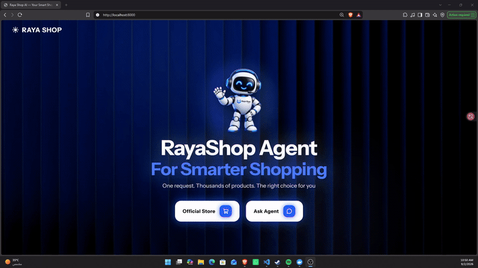
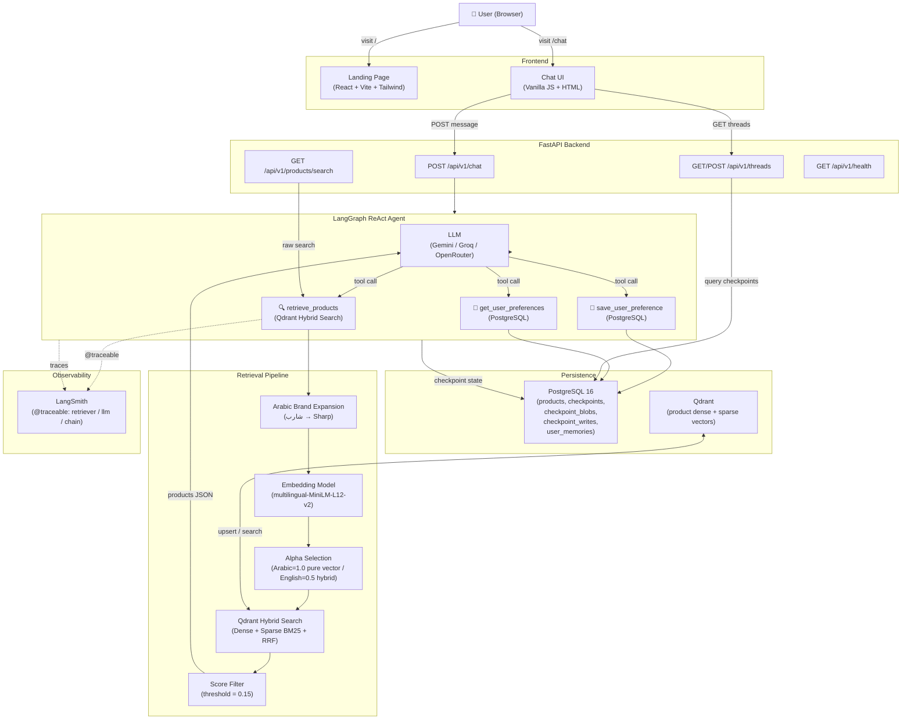

<div align="center">

# 🤖 RayaShop Agent

**An AI-powered shopping assistant for [RayaShop](https://www.rayashop.com/en) — discover the right product through natural conversation, in English or Egyptian Arabic.**


<br/>

</div>

---

## 💡 Inspiration

Online shopping can become overwhelming when users need to browse through many products before making a decision. A user may open one product, go back, check another one, compare different options, and eventually lose track of the products they were interested in.

We wanted to make this process easier by turning product discovery into a **conversational experience**. Instead of navigating through many product pages manually, users can interact with an AI shopping assistant, explore different options, ask for alternatives, and continue the conversation while keeping the context of what they have already explored.

---

## ✨ Project Overview

**RayaShop Agent** is an AI-powered shopping assistant built on top of RayaShop's product catalog. Instead of forcing users to browse many product pages one by one, the agent lets them **explore products conversationally** — asking for options, refining requests, asking for alternatives, and building on previous turns — all in a single chat interface.

**The problem it solves:** Product discovery is tedious. Users go back and forth between product pages, lose context, and struggle to compare options efficiently.

**Who it is for:** Anyone shopping on RayaShop who wants a faster, more guided way to find the right product — especially across large, unfamiliar catalogs spanning electronics, appliances, accessories, and more.

**What users can do:**
- Describe what they are looking for in natural language (English or Egyptian Arabic)
- Explore multiple product options in one place
- Ask for more or similar products
- Refine requests through follow-up questions
- Maintain conversation context across the entire session
- Save and retrieve personal preferences for a more personalized experience

---

## 🎬 Demo & 📸 Screenshots

### 🎥 Demo



### 🖼️ Screenshots

| Landing Page | Chat UI |
|:---:|:---:|
|  |  |

---

## 🎯 Features

| Feature | Details |
|---|---|
| 🧠 **ReAct Agent (LangGraph)** | Tool-calling agent built with `create_react_agent`; decides autonomously when to search, recall, or respond |
| 🔎 **Hybrid Search (Qdrant)** | Combines dense vector search (`paraphrase-multilingual-MiniLM-L12-v2`) with sparse BM25 and Reciprocal Rank Fusion (RRF) |
| 🌍 **Multilingual** | Strict language matching — Arabic queries get Arabic responses; English queries get English responses |
| 🗄️ **Persistent User Preferences** | Budget, brand, color, and other preferences saved per-thread to PostgreSQL; recalled in future turns |
| ⚡ **Persistent Conversation State** | Full conversation state checkpointed via `langgraph-checkpoint-postgres`; threads survive server restarts |
| 🔌 **Pluggable LLM** | Swap between Gemini, OpenRouter, or Groq via a single `.env` variable — no code changes needed |
| 📊 **LangSmith Tracing** | `@traceable` decorators on retrieval, generation, and full RAG chain; traces sent to LangSmith project |
| 🗃️ **Full Data Pipeline** | Scraping → PostgreSQL → Qdrant ingestion pipeline with dense + sparse dual embeddings |
| 📐 **Retrieval Eval Suite** | 12 golden queries (positive + negative) with Hit@k, MRR, Precision@k, and Negative Accuracy metrics |
| 🐳 **Docker Compose** | One-command deployment of app + Qdrant + PostgreSQL with health checks |

---

## 🏗️ How It Works

RayaShop Agent is built around a **LangGraph ReAct agent** that uses tools to interact with the product catalog and user preferences. The agent decides autonomously when to search for products, when to save preferences, and when to just respond.

**High-level flow:**
1. A user sends a message from the chat interface.
2. The **FastAPI** backend receives it and passes it to the LangGraph agent.
3. The agent uses its LLM (Gemini, Groq, or OpenRouter) to decide which tool to call.
4. If products are needed, the **retrieval tool** performs hybrid search on **Qdrant** — combining dense semantic embeddings with sparse BM25 keyword search, fused via Reciprocal Rank Fusion.
5. If a preference needs to be remembered, it is saved to **PostgreSQL**.
6. The LLM generates a conversational response and product cards are shown in the UI.
7. The full conversation state is **checkpointed to PostgreSQL** so sessions persist across restarts.
8. All steps are **traced to LangSmith** for observability.


```mermaid
flowchart TD
    User["👤 User (Browser)"]

    subgraph Frontend["Frontend"]
        Landing["Landing Page\n(React + Vite + Tailwind)"]
        ChatUI["Chat UI\n(Vanilla JS + HTML)"]
    end

    subgraph API["FastAPI Backend"]
        ChatRoute["POST /api/v1/chat"]
        ProductsRoute["GET /api/v1/products/search"]
        ThreadsRoute["GET/POST /api/v1/threads"]
        HealthRoute["GET /api/v1/health"]
    end

    subgraph Agent["LangGraph ReAct Agent"]
        LLM["LLM\n(Gemini / Groq / OpenRouter)"]
        Tool1["🔍 retrieve_products\n(Qdrant Hybrid Search)"]
        Tool2["💾 save_user_preference\n(PostgreSQL)"]
        Tool3["📂 get_user_preferences\n(PostgreSQL)"]
    end

    subgraph Retrieval["Retrieval Pipeline"]
        Embedder["Embedding Model\n(multilingual-MiniLM-L12-v2)"]
        BrandMap["Arabic Brand Expansion\n(شارب → Sharp)"]
        AlphaLogic["Alpha Selection\n(Arabic=1.0 pure vector / English=0.5 hybrid)"]
        QdrantHybrid["Qdrant Hybrid Search\n(Dense + Sparse BM25 + RRF)"]
        ScoreFilter["Score Filter\n(threshold = 0.15)"]
    end

    subgraph Storage["Persistence"]
        Postgres["PostgreSQL 16\n(products, checkpoints,\ncheckpoint_blobs,\ncheckpoint_writes,\nuser_memories)"]
        QdrantDB["Qdrant\n(product dense + sparse vectors)"]
    end

    subgraph Obs["Observability"]
        LangSmith["LangSmith\n(@traceable: retriever / llm / chain)"]
    end

    User -->|"visit /"| Landing
    User -->|"visit /chat"| ChatUI
    ChatUI -->|POST message| ChatRoute
    ChatUI -->|"GET threads"| ThreadsRoute

    ChatRoute --> Agent
    Agent --> LLM
    LLM -->|tool call| Tool1
    LLM -->|tool call| Tool2
    LLM -->|tool call| Tool3

    Tool1 --> BrandMap
    BrandMap --> Embedder
    Embedder --> AlphaLogic
    AlphaLogic --> QdrantHybrid
    QdrantHybrid --> ScoreFilter
    ScoreFilter -->|"products JSON"| LLM

    Tool2 --> Postgres
    Tool3 --> Postgres

    Agent -->|"checkpoint state"| Postgres
    QdrantDB <-->|"upsert / search"| QdrantHybrid

    ProductsRoute -->|"raw search"| Tool1
    ThreadsRoute -->|"query checkpoints"| Postgres

    Agent -.->|"traces"| LangSmith
    Tool1 -.->|"@traceable"| LangSmith
```

---

## 🛠️ Technology Stack

| Layer | Technology | Purpose |
|---|---|---|
| **Backend** | FastAPI 0.115+, Python 3.12, Uvicorn | REST API and server |
| **Agent Framework** | LangGraph 1.2+ (`create_react_agent`), LangChain Core | AI agent orchestration and tool calling |
| **LLM Providers** | Google Gemini, Groq, OpenRouter | Language model (switchable via `.env`) |
| **Embedding Model** | `paraphrase-multilingual-MiniLM-L12-v2` (HuggingFace, dim=384) | Dense semantic embeddings |
| **Sparse Embedding** | `fastembed` with `Qdrant/bm25` model | BM25 keyword-based sparse vectors |
| **Vector Database** | Qdrant (primary) · Weaviate (alternative) | Hybrid vector search |
| **Relational Database** | PostgreSQL 16 | Products, LangGraph state, user preferences |
| **ORM / Migrations** | SQLAlchemy 2.0, Alembic | Database models and schema migrations |
| **State Persistence** | `langgraph-checkpoint-postgres` (`PostgresSaver`) | Persistent conversation checkpointing |
| **Observability** | LangSmith (`@traceable` on retriever, llm, chain) | Tracing and debugging |
| **Landing Page** | React 19, TypeScript, Vite, Tailwind CSS, Motion | Landing page UI |
| **Chat UI** | Vanilla JS + CSS | Lightweight chat interface |
| **Deployment** | Docker Compose (app + Qdrant + PostgreSQL) | Container orchestration |
| **Package Manager** | `uv` | Python dependency management |

---

## 📁 Project Structure

```
RayaShop-Agent/
├── src/
│   ├── main.py                        # FastAPI app entry point: lifespan, routers, static serving
│   ├── Agent/
│   │   ├── shopping_agent.py          # LangGraph ReAct agent (singleton)
│   │   ├── checkpointer.py            # PostgresSaver with MemorySaver fallback
│   │   └── tools/
│   │       ├── retrieval_tool.py      # Qdrant hybrid search tool (@tool)
│   │       └── memory_tool.py         # save/get user preferences via PostgreSQL
│   ├── api/
│   │   ├── routes/
│   │   │   ├── chat.py                # POST /api/v1/chat
│   │   │   ├── products.py            # GET  /api/v1/products/search
│   │   │   ├── threads.py             # GET/POST /api/v1/threads
│   │   │   └── health.py              # GET  /api/v1/health
│   │   └── schemas/                   # Pydantic request/response models
│   ├── infrastructure/
│   │   ├── llm/
│   │   │   ├── factory.py             # LLMFactory (Gemini / Groq / OpenRouter)
│   │   │   └── providers/             # gemini.py, groq.py, openrouter.py
│   │   ├── embeddings/
│   │   │   ├── factory.py             # EmbeddingFactory
│   │   │   └── providers/             # huggingface.py, gemini.py
│   │   ├── vector_db/
│   │   │   ├── factory.py             # VectorDBFactory
│   │   │   ├── interface.py           # VectorStore ABC
│   │   │   └── providers/
│   │   │       ├── qdrant.py          # QdrantDB: hybrid search with RRF fusion
│   │   │       └── weaviate.py        # WeaviateDB (alternative provider)
│   │   ├── scraping/                  # Raya scraper (category + product detail)
│   │   └── ingestion/
│   │       ├── product_ingestion.py   # Basic catalog scrape → PostgreSQL
│   │       └── raya_product_details_ingestion.py  # Enriched product details → PostgreSQL
│   ├── db/
│   │   ├── models/
│   │   │   ├── product.py             # SQLAlchemy Product model (JSONB attributes)
│   │   │   └── product_image.py       # ProductImage model
│   │   ├── repositories/product.py    # ProductRepository (CRUD)
│   │   ├── session.py                 # SQLAlchemy engine + SessionLocal
│   │   └── migration/                 # Alembic migrations (3 revisions)
│   ├── config/
│   │   └── settings.py                # Pydantic Settings (nested, env-driven)
│   ├── observability/
│   │   └── tracing.py                 # LangSmith setup + @traceable wrappers
│   └── scripts/
│       ├── scrape_raya.py             # ← Step 1: Scrape catalog → PostgreSQL
│       ├── postgres_to_qdrant.py      # ← Step 2: PostgreSQL → Qdrant (dense + sparse)
│       ├── clear_chats.py             # Truncate checkpoints + user_memories
│       └── init_db.sql                # PostgreSQL extensions (auto-loaded by Docker)
├── frontend/
│   ├── src/
│   │   ├── App.tsx                    # Landing page (React, Tailwind, Motion, HLS video)
│   │   └── components/
│   │       ├── Navbar.tsx
│   │       └── BackgroundBeams.tsx
│   └── public/
│       ├── chat.html                  # Chat page (vanilla HTML)
│       ├── app.js                     # Chat logic: sessions, messaging, product panel
│       └── styles.css                 # Chat UI styles
├── tests/
│   ├── integration/                   # Agent, LLM, Qdrant, retrieval tests
│   └── unit/                          # Vector DB unit tests
├── eval/
│   ├── golden_set.py                  # 12 golden queries (positive + negative)
│   └── run_eval.py                    # Hit@k, MRR, Precision@k, Negative Accuracy runner
├── assets/                            # Screenshots and demo media
├── docker-compose.yml                 # App + Qdrant + PostgreSQL
├── Dockerfile                         # Python 3.12 + uv
├── pyproject.toml                     # Python project dependencies
└── package.json                       # Frontend (React/Vite) dependencies
```

---

## ⚙️ Configuration

All configuration is driven by environment variables. The application uses nested env variables separated by `__`.

Create a `.env` file in the project root with the following variables:

```env
# ── Application ──────────────────────────────────
APP__NAME=RayaShop Agent
APP__ENV=production
APP__DEBUG=false

# ── API ──────────────────────────────────────────
API__HOST=0.0.0.0
API__PORT=8000

# ── PostgreSQL ────────────────────────────────────
POSTGRES__HOST=localhost
POSTGRES__PORT=5432
POSTGRES__DATABASE=rayashop
POSTGRES__USER=rayashop_user
POSTGRES__PASSWORD=your_password

# ── Vector Database ───────────────────────────────
VECTOR_DB_PROVIDER=qdrant
QDRANT__URL=http://localhost:6333
QDRANT__COLLECTION_NAME=rayashop_products
QDRANT__VECTOR_SIZE=384
QDRANT__DISTANCE_METRIC=cosine

# ── Embedding ─────────────────────────────────────
EMBEDDING__PROVIDER=huggingface
EMBEDDING__HUGGINGFACE__MODEL_NAME=sentence-transformers/paraphrase-multilingual-MiniLM-L12-v2

# ── LLM (choose one provider) ────────────────────
LLM__PROVIDER=gemini

LLM__GEMINI__API_KEY=your_gemini_key
LLM__GEMINI__MODEL=gemini-2.0-flash

LLM__OPENROUTER__API_KEY=your_openrouter_key
LLM__OPENROUTER__MODEL=google/gemini-2.0-flash-exp:free

LLM__GROQ__API_KEY=your_groq_key
LLM__GROQ__MODEL=llama3-8b-8192

# ── Scraper ───────────────────────────────────────
SCRAPER__PROVIDER=raya
SCRAPER__RAYA__BASE_URL=https://www.rayashop.com
SCRAPER__RAYA__API_KEY=your_raya_api_key
SCRAPER__RAYA__STORE_CODE=eg

# ── LangSmith (optional, for observability) ───────
LANGSMITH_TRACING=true
LANGSMITH_ENDPOINT=https://api.smith.langchain.com
LANGSMITH_API_KEY=your_langsmith_api_key
LANGSMITH_PROJECT=RayaShopT
```

> [!NOTE]
> `QDRANT__API_KEY` is only required if you are connecting to Qdrant Cloud. For the local Docker Compose setup, you can leave it unset.

---

## 🚀 Setup & Installation

### Prerequisites

| Requirement | Version | Notes |
|---|---|---|
| Python | 3.12+ | Required for backend |
| Node.js | 18+ | Required for building the frontend |
| `uv` | Latest | Python package manager |
| Docker & Docker Compose | Latest | For containerized setup (recommended) |

Install `uv`:
```bash
pip install uv
```

---

### Option 1 — Docker Compose (Recommended)

This is the easiest way to run the full application. Docker Compose starts the backend, Qdrant, and PostgreSQL together.

> [!IMPORTANT]
> Before running Docker Compose, you still need to populate the database with product data. Docker Compose only starts the **infrastructure** — it does not scrape or ingest products automatically. See the [Reproducing the Product Catalog](#-reproducing-the-product-catalog) section below.

```bash
# 1. Clone the repository
git clone https://github.com/your-username/RayaShop-Agent.git
cd RayaShop-Agent

# 2. Create and configure your environment file
# (copy the configuration block from the Configuration section above into a new .env file)

# 3. Build the frontend
npm install
npm run build

# 4. Start all services (backend app + Qdrant + PostgreSQL)
docker compose up --build

# 5. Open in browser
# http://localhost:8000
```

The app waits for Qdrant and PostgreSQL to pass health checks before starting.

---

### Option 2 — Local Development

**Prerequisites:** Python 3.12+, PostgreSQL 16 running locally, Qdrant running locally, Node.js 18+, `uv`.

```bash
# 1. Clone the repository
git clone https://github.com/your-username/RayaShop-Agent.git
cd RayaShop-Agent

# 2. Install Python dependencies
uv sync

# 3. Build the frontend
npm install
npm run build

# 4. Create your .env file (see Configuration section above)
#    Set POSTGRES__HOST=localhost and QDRANT__URL=http://localhost:6333

# 5. Run database migrations
uv run alembic -c src/db/migration/alembic.ini upgrade head

# 6. (See product catalog section below for scraping + indexing steps)

# 7. Start the development server
uv run uvicorn src.main:app --reload --port 8000
```

---

## 🗃️ Reproducing the Product Catalog

> [!IMPORTANT]
> If you are starting from a fresh clone, the PostgreSQL database and Qdrant vector store will be empty. You must run the data pipeline below before the agent can find any products.

The data pipeline has **two stages**:

```
Stage 1: Raya API (scraper) → PostgreSQL
Stage 2: PostgreSQL → Qdrant (dense + sparse vectors)
```

### Stage 1 — Scrape and Ingest Products into PostgreSQL

This script scrapes the RayaShop product catalog via the Raya API and stores all products in PostgreSQL.

```bash
uv run python src/scripts/scrape_raya.py
```

> [!NOTE]
> This script requires `SCRAPER__RAYA__API_KEY` to be set in your `.env` file. It connects to the Raya GraphQL API and may take some time depending on catalog size.

What it does:
- Scrapes all product categories and product listings from the Raya API
- Saves products (name, SKU, URL, price, thumbnail, stock status) into the `products` PostgreSQL table

### Stage 2 — Index Products into Qdrant (Embeddings)

After products are in PostgreSQL, run this script to generate embeddings and populate Qdrant:

```bash
uv run python -m src.scripts.postgres_to_qdrant
```

What it does:
1. Reads all products from PostgreSQL
2. Builds a rich semantic text per product: `Product: {name}\nBrand: {brand}\nCategory: {category}\nDescription: {desc}\n{attributes...}`
3. Generates **dense vectors** via `paraphrase-multilingual-MiniLM-L12-v2`
4. Generates **sparse BM25 vectors** via `fastembed`
5. Upserts dual-vector records into Qdrant with full product payloads in batches of 128

---

### Complete Order of Operations (Fresh Start)

Follow this exact order when setting up from scratch:

```
1. Configure .env
2. Start infrastructure (PostgreSQL + Qdrant)
3. Run database migrations
4. Run the scraper  →  products into PostgreSQL
5. Run the indexer  →  embeddings into Qdrant
6. Start the backend
7. Open the app in your browser
```

**Using Docker Compose:**

```bash
# Step 1: Configure .env

# Step 2: Start only the infrastructure (not the app yet)
docker compose up qdrant postgres -d

# Step 3: Run database migrations
uv run alembic -c src/db/migration/alembic.ini upgrade head

# Step 4: Scrape products into PostgreSQL
uv run python src/scripts/scrape_raya.py

# Step 5: Index products into Qdrant
uv run python -m src.scripts.postgres_to_qdrant

# Step 6: Start the full application
docker compose up app
```

**Using local development:**

```bash
# Step 1: Configure .env

# Step 2: Start PostgreSQL and Qdrant locally (or via Docker)
docker compose up qdrant postgres -d

# Step 3: Run database migrations
uv run alembic -c src/db/migration/alembic.ini upgrade head

# Step 4: Scrape products into PostgreSQL
uv run python src/scripts/scrape_raya.py

# Step 5: Index products into Qdrant
uv run python -m src.scripts.postgres_to_qdrant

# Step 6: Start the backend
uv run uvicorn src.main:app --reload --port 8000

# Open http://localhost:8000
```

---

## 🐳 Docker Usage

### Start everything

```bash
docker compose up --build
```

### Start in the background (detached)

```bash
docker compose up --build -d
```

### View logs

```bash
docker compose logs -f
```

### Stop the application (keeps data)

```bash
docker compose down
```

> [!WARNING]
> Do **not** run `docker compose down -v` unless you intentionally want to delete all persisted data.
>
> - `docker compose down` — stops and removes containers, **but keeps** the PostgreSQL and Qdrant data volumes
> - `docker compose down -v` — stops containers **and deletes all volumes**, including your scraped products and vector embeddings. You would need to re-run the full data pipeline to recover.

### Docker Services

| Service | Image | Port | Purpose |
|---|---|---|---|
| `app` | Custom (Python 3.12 + uv) | `8000` | FastAPI application |
| `qdrant` | `qdrant/qdrant:latest` | `6333` (HTTP), `6334` (gRPC) | Vector database |
| `postgres` | `postgres:16-alpine` | `5432` | Relational database |

All services have health checks. The `app` container waits for both `qdrant` and `postgres` to pass health checks before starting.

---

## 🗣️ Demo — How to Use

Once the application is running at `http://localhost:8000`:

1. Visit the landing page and click **Start Shopping**
2. You will be taken to the chat interface at `/chat`
3. Start a new conversation or pick up a previous session from the sidebar

**Example conversations:**

> "Show me wireless headphones under 5000 EGP"

> "Any Sony ones?"

> "What about noise-cancelling options?"

> "I prefer Samsung. Remember that for future searches."

> "I'm looking for a 55-inch TV — what do you have?"

> "Show me more options from LG"

> "What's the best laptop bag you have?"

> "Find me a power bank with fast charging"

> "اعرضلي تكييفات شارب" *(Show me Sharp air conditioners)*

> "عاوز بديل أرخص" *(I want a cheaper alternative)*

The agent maintains context throughout the conversation. You can ask for alternatives, filter by brand or price, and the agent will remember preferences you have shared across turns.

---

## 📊 Retrieval Evaluation

The `eval/` directory contains a retrieval evaluation suite against 12 golden queries.

```bash
# Default k=5
uv run python -m eval.run_eval

# k=3 with verbose query notes
uv run python -m eval.run_eval --k 3 --verbose
```

**Metrics reported:**

| Metric | Description |
|---|---|
| **Hit@k** | At least 1 relevant result in top-k (positive cases only) |
| **MRR** | Mean Reciprocal Rank — `1/rank` of first relevant hit |
| **Precision@k** | Fraction of relevant results in top-k |
| **Negative Accuracy** | Fraction of greetings/nonsense queries that correctly return nothing |
| **Avg Latency** | Mean retrieval latency in milliseconds |

**Golden set examples:**

```python
{"query": "SONY WH-1000XM5",      "expect_any": ["wh-1000xm5"]}   # Exact model — BM25 should dominate
{"query": "wireless headphones",   "expect_any": ["wireless", "headphone"]}  # Semantic category
{"query": "gaming mouse",          "expect_any": ["gaming mouse", "gaming"]}  # Category + use case
{"query": "55 inch tv",            "expect_any": ["55"]}            # Size attribute
{"query": "اهلا",                  "expect_any": []}                # Arabic greeting → no results
{"query": "flying car with wings", "expect_any": []}                # Non-catalog → no results
```

---

## 📈 Observability

The application is instrumented with [LangSmith](https://smith.langchain.com) for tracing at three levels:

| Traced Function | Run Type | What it captures |
|---|---|---|
| `trace_retrieval` | `retriever` | Hybrid Qdrant search span — query, results, latency |
| `trace_generation` | `llm` | LLM invocation span — prompt and response |
| `trace_rag_pipeline` | `chain` | Full RAG chain as a single parent span |

**To enable LangSmith tracing:**

1. Create a free account at [smith.langchain.com](https://smith.langchain.com)
2. Create a project (e.g., `RayaShopT`)
3. Get your API key from the Settings page
4. Add to your `.env`:

```env
LANGSMITH_TRACING=true
LANGSMITH_ENDPOINT=https://api.smith.langchain.com
LANGSMITH_API_KEY=your_langsmith_api_key
LANGSMITH_PROJECT=RayaShopT
```

LangSmith tracing is automatically initialized on application startup. If `LANGSMITH_API_KEY` is missing, the app will log a warning but continue running without tracing.

---

## 🌐 API Reference

### `POST /api/v1/chat`

```json
// Request
{
  "message": "عاوز تكييف شارب 1.5 حصان",
  "thread_id": "optional-uuid"
}

// Response
{
  "thread_id": "550e8400-e29b-41d4-a716-446655440000",
  "response": "لقيتلك 3 تكييفات شارب بـ 1.5 حصان، شوف المنتجات على اليمين!",
  "products": [
    {
      "id": 1234,
      "name": "Sharp 1.5HP Inverter AC",
      "brand": "Sharp",
      "price": 18999.0,
      "old_price": 21999.0,
      "url": "https://www.rayashop.com/...",
      "thumbnail": "https://...",
      "stock_status": "in_stock"
    }
  ]
}
```

### `GET /api/v1/products/search?q=iphone+16&limit=7`

Direct product search — returns raw retrieval results without LLM generation.

### `GET /api/v1/threads` · `POST /api/v1/threads`

List all historical sessions from PostgreSQL checkpoints / create a new session.

### `GET /api/v1/threads/{id}/messages`

Retrieve full conversation history for a thread.

### `GET /api/v1/health`

Returns service status, API version, and uptime in seconds.

---

## 🧪 Tests

```bash
# All tests
uv run pytest

# Integration tests only
uv run pytest tests/integration/ -v

# Unit tests only
uv run pytest tests/unit/ -v
```

| Test File | Coverage |
|---|---|
| `test_shopping_agent.py` | End-to-end agent invocation |
| `test_qdrant_retrieval.py` | Hybrid search correctness |
| `test_agent_memory.py` | Preference save/recall across turns |
| `test_llm_providers.py` | Gemini / Groq / OpenRouter connectivity |
| `test_retrieval_tool.py` | Tool invocation and score filtering |
| `test_vector_db.py` | VectorStore unit tests |

---

## 🛠️ Utility Scripts

```bash
# Re-index all products from PostgreSQL into Qdrant
uv run python -m src.scripts.postgres_to_qdrant

# Clear all chat history and user memories (useful before demos)
uv run python -m src.scripts.clear_chats
```

---

## 🗃️ Database Schema

### `products` table

| Column | Type | Notes |
|---|---|---|
| `id` | `BIGINT PK` | Product ID |
| `name` | `TEXT NOT NULL` | Product name |
| `sku` | `VARCHAR(255) UNIQUE` | Stock-keeping unit |
| `url` | `TEXT NOT NULL` | Product page URL |
| `brand` | `VARCHAR(255)` | Brand name (indexed) |
| `category` | `VARCHAR(255)` | Category (indexed) |
| `description` | `TEXT` | Full description |
| `short_description` | `TEXT` | Short description |
| `attributes` | `JSONB` | Flexible product specs |
| `price` | `NUMERIC(12,2)` | Current price (EGP) |
| `old_price` | `NUMERIC(12,2)` | Pre-discount price |
| `thumbnail` | `TEXT` | Thumbnail image URL |
| `stock_status` | `VARCHAR(50)` | `in_stock` / `out_of_stock` (indexed) |
| `created_at` | `TIMESTAMPTZ` | Auto-set on insert |
| `updated_at` | `TIMESTAMPTZ` | Auto-updated on change |

### LangGraph Checkpointer Tables (auto-created by `PostgresSaver.setup()`)

| Table | Purpose |
|---|---|
| `checkpoints` | Full agent state snapshots per thread |
| `checkpoint_blobs` | Binary data blobs for large state values |
| `checkpoint_writes` | Incremental write log |
| `checkpoint_migrations` | Schema version tracking |
| `user_memories` | Per-thread user preferences (brand, budget, etc.) |

---

## 📚 What We Learned — FirstCommit

This project taught us that building an AI agent is much more than connecting an LLM to a prompt.

Building RayaShop Agent gave us practical experience with:

- **Agent orchestration** — using LangGraph's `create_react_agent` to build a tool-calling agent that decides autonomously how to respond
- **Hybrid information retrieval** — combining semantic vector search with BM25 keyword search and fusing results with Reciprocal Rank Fusion
- **Vector databases and embeddings** — building, storing, and querying dense and sparse vector representations of product data
- **Persistent state and user preferences** — checkpointing full conversation state to PostgreSQL so sessions survive restarts
- **Retrieval evaluation** — designing a golden set of test queries and measuring Hit@k, MRR, Precision@k, and Negative Accuracy
- **Observability** — using LangSmith's `@traceable` decorator to trace retrieval, LLM calls, and full RAG chains
- **Backend/frontend integration** — connecting an AI backend to a React landing page and a vanilla JS chat UI
- **Docker Compose** — packaging a multi-service application (backend, vector DB, relational DB) for reproducible deployment

Most importantly, we learned how different components of an AI application need to work together to create a reliable user experience.

---

## 🤖 AI Assistance Disclosure

AI coding tools (including LLMs) were used as development and learning assistance during this project — for researching APIs, understanding library documentation, and helping debug specific components.

All implementation, integration, testing, and debugging decisions were made, reviewed, and executed by the developer. The architecture, data pipeline design, retrieval strategy, and evaluation approach reflect the developer's own engineering choices.

---

## 🔭 Future Improvements

- **Richer product comparison** — let users compare two or more products side by side within the conversation
- **Improved personalization** — use saved preferences more actively to re-rank and filter results across turns
- **Product filtering by attributes** — expose structured filters (e.g., price range, brand, category) through the agent
- **Cart / wishlist actions** — allow the agent to help users move from discovering products to completing their shopping journey
- **Stronger retrieval evaluation** — expand the golden set and add end-to-end response quality metrics
- **Streaming responses** — stream LLM tokens to the frontend for faster perceived response times

---
